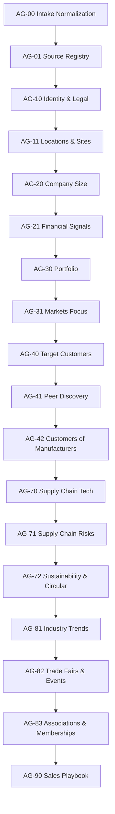

# Workflow DAG & Parallelization

This document reflects the **current, enforced DAG** and how the scheduler decides what can run in parallel.

## 1. Source of Truth

The pipeline DAG is loaded directly from `configs/pipeline/dag.yml`, and every run follows that order exactly as listed in the file. The orchestrator walks the DAG nodes sequentially and hard-fails if any dependency is missing. This means **the declared DAG is authoritative** for step ordering and parallelization eligibility.

## 2. Current DAG (v1)

The current DAG is a **linear chain** (no fan-out). As configured today, there is no parallel execution; every step depends on the previous one.



### DAG Definition (excerpt)

```yaml
- step_id: "AG-00"
  depends_on: []
- step_id: "AG-01"
  depends_on: ["AG-00"]
- step_id: "AG-10"
  depends_on: ["AG-01"]
# ...
- step_id: "AG-90"
  depends_on: ["AG-83"]
```

## 3. Parallelization Rules

Parallelism is **possible**, but only when the DAG contains multiple nodes that depend on the same prerequisites. The batch scheduler computes the ready set by checking whether a node's dependencies are a subset of completed steps.

- If two steps share the same dependency set (or one depends only on already completed nodes), they are **eligible to run in parallel**.
- If a step has any unmet dependency, it **must not** run.

As of the current DAG, **every node depends on the immediately previous step**, so **no parallel batches exist**.

## 4. Change Policy

To introduce real parallelization:

1. Update `configs/pipeline/dag.yml` to introduce branches.
2. Ensure the orchestrator continues to enforce dependency presence (no implicit ordering).
3. Keep gatekeeping intact: any step failure stops downstream nodes even if they were parallel-eligible.

The DAG remains the single control plane for step ordering and potential concurrency.
